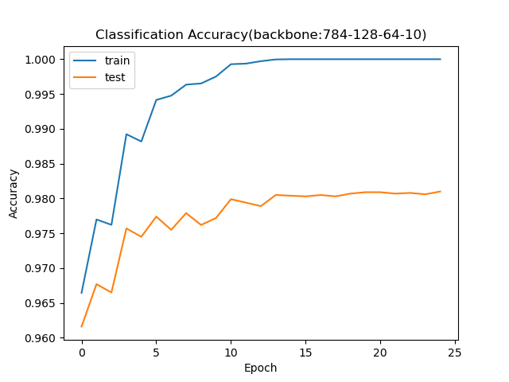

# 多层神经网络的训练

## 作业要求

**请根据自己的计算环境情况和兴趣，选择以下两个数据集之一，完成如下的实验：**

- [MNIST](http://yann.lecun.com/exdb/mnist/)
- [CIFAR](https://www.cs.toronto.edu/~kriz/cifar.html)

**1. 构造一个多层的神经网络（注意，不要使用卷积神经网络，本题目要求使用多层神经网络），并在上述数据集任务上进行训练，并汇报一个“使用了你认为最优的超参数配置的神经网络”的学习曲线；要求如下：**

（1）自己手动完成反向传播算法部分的编写；
（2）该网络应为一个“纯净”的多层神经网络，不使用正则化方法、率优化算法等；

**2. 在上述“你认为最优配置的神经网络”的基础上，**

（1）分别汇报“增加一个隐藏层”和“减小一个隐藏层”情况下的学习曲线；
（2）分别汇报使用BGD和SGD进行训练的学习曲线；
（3）分别汇报使用两种以上参数初始化方法下的学习曲线；
（4）分别汇报使用两种以上学习率优化算法下的学习曲线；
（5）分别汇报使用两种以上正则化方法下的学习曲线；

**最终提交：包含6个子文件夹的一个zip文件，其中的子文件夹应包含：**

（1）对应上述6种情况之一的一份源代码；
（2）对应上述源代码的学习曲线的一个.png文件；

## 作业项目说明

本项目选择[MNIST](http://yann.lecun.com/exdb/mnist/)数据集

[problem-1](./problem-1/problem-1.ipynb)：使用 `numpy`手工构造了一个多层神经网络
    - 网络结构为：784-128-64-10
    - 隐藏层激活函数为ReLU
    - 输出层激活函数为Softmax
    - 损失函数为交叉熵
    - 优化器为MBGD
    - 学习率为0.1
    - BatchSize为64
    - 迭代次数为25

    

[problem-2](./problem-2/problem-2.ipynb)：实验隐藏层数量的多少对训练和预测的影响
    - 原始网络结构（每层神经元个数）：784-128-64-10
    - 增加隐藏层网络结构（每层神经元个数）：784-128-64-64-10
    - 减少隐藏层网络结构（每层神经元个数）：784-128-10

    

[problem-3](./problem-3/problem-3.ipynb)：实验对比不同梯度下降方法（BGD&SGD）对训练的影响

    

[problem-4](./problem-4/problem-4.ipynb)：实验对比不同初始化方法对训练的影响

    

[problem-5](./problem-5/problem-5.ipynb)：实验对比不同学习率优化算法对训练的影响

    

[problem-6](./problem-6/problem-6.ipynb)：实验对比不同正则化方法对训练的影响

    

