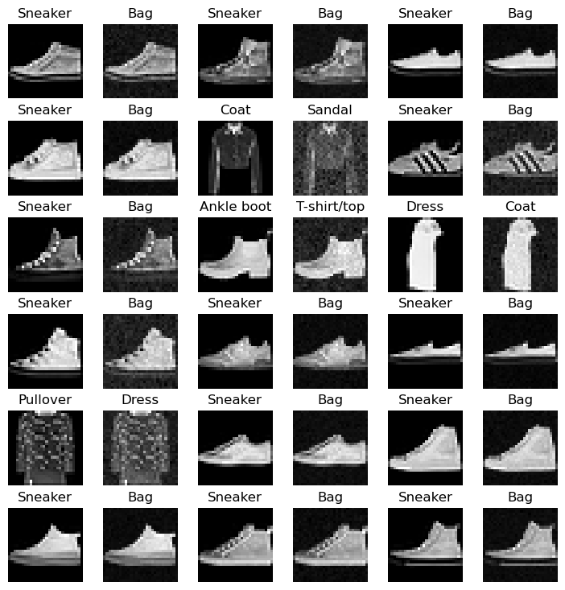
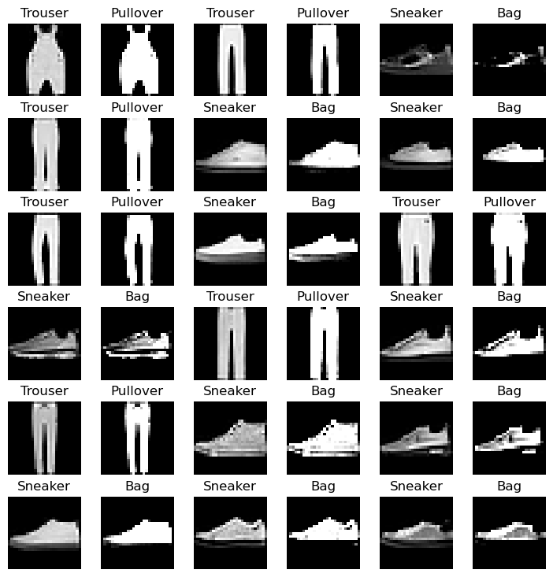

# 深度学习技术与应用-第二次作业

- 李锦韬 2201213292
- 作业内容简介：训练[Fashion-MNIST](https://github.com/zalandoresearch/fashion-mnist)数据集上的分类模型；进行定向白盒攻击（I-FGSM）；进行定向黑盒攻击（样本迁移、MCMC）；简单对抗训练
- 若样本的真实标签为 label ，攻击方向为使分类器错判为 (label + 1) % 10
- 本项目主要代码情况和结论摘要：
  - `./code/ResNet34.ipynb` **分类器构建和训练评估：** 基于ResNet34结构进行训练，最终选用的版本在测试集上精度为 $93.71\%$
  - `./code/white-attack.ipynb` **白盒攻击：** 基于I-FGSM算法，$\epsilon$ 取 $0.02$ ，对项目ResNet模型攻击成功率为 $14.37\%$
  - `./code/black-attack.ipynb` **黑盒攻击：** 对课程CNN模型采用样本迁移和MCMC采样攻击，攻击成功率分别为 $7.9\%$ 和 $10.4\%$ ；对项目ResNet模型采用MCMC采样攻击攻击，攻击成功率为 $9.73\%$
  - `./code/adversarial-train.ipynb` **对抗训练：** 对项目初始ResNet模型在训练集上进行白盒攻击获取对抗样本，扩充训练集重新训练得到新分类器，新模型在测试集上的精度为 $92.10\%$ ，白盒攻击成功率为 $5.1\%$ ，黑盒攻击成功率为 $9.67\%$ 
- 项目内图像文件说明：
  - `./images/White-N*.png` 白盒攻击ResNet模型中的成功攻击样本
  - `./images/Black-N*.png` 黑盒攻击CNN模型中的成功攻击样本
  - `./images/White-NewRes-N*.png` 白盒攻击新分类器模型中的成功攻击样本
  - `./images/Black-NewRes-N*.png` 黑盒攻击新分类器模型中的成功攻击样本
  - 其他图像文件为作业说明markdown所使用
- 其他项目支撑文件：
  - `./code/ResNet34_draft.ipynb` 尝试不同的超参数和数据预处理方式训练分类器模型
  - `./code/white-nodir.ipynb` 尝试不定向白盒攻击，实验其与定向攻击的异同
  - `./code/model.py` 课程CNN模型
  - `./code/fmnist_dataset.py` 课程数据读入文件
- 项目使用Git管理版本，GitHub地址为[DeepLearning-PKUCourse-homework-2](https://github.com/AkexStar/LiGe-DeepLearning-PKUCourse/tree/main/homework-2)

## 训练分类器

- 架构选择ResNet34网络
- 更改输入与输出层，使其能适应 `Fashion-MNIST` 数据集
- 训练参数设置：
  - 数据预处理：随机水平翻转、随机裁剪、随机擦除、标准化
  - 优化器：optimizer=Adam
  - 学习率：lr=0.001
  - 学习率衰减：gama=0.1，step_size=10
  - 损失函数：CrossEntropyLoss
  - 训练轮数：40
  - 批次大小：128
- 最终在测试集上的精度：$94\%$ 左右
- 作业所有实验采用精度为 $93.71\%$ 的模型进行测试
- 模型文件路径为 `./model/checkpoint-60-93.71.pt`

以下为分类器训练情况以及类器在测试集上的混淆矩阵：

   

## 白盒攻击

- 白盒攻击在本项目构建的ResNet34分类器上进行，算法采用定向的I-FGSM。该算法相当于使用迭代的FGSM，逐步修改测试图像，根据当前图像和目标类别之间的梯度，每次给图像变动 $\varepsilon \times \operatorname{Sign}\left( \nabla_{x^{(n)}}\left({x}^{(n)}, \hat{y} | C \right) \right)$ ，其中 $\epsilon$ 为参数。由于是定向攻击，给图像施加的扰动方向应该是梯度的反方向。
- 本项目定义的攻击成功率计算方式为：基于I-FGSM算法，在迭代100次以内，扰动后的测试图像被分类器判断为目标类别的数量占所有被分类器正确分类的测试图像的比例。
- 本项目实验了许多不同的 $\epsilon$ 取值，在 $[.01, .02, .03, .1, .2, .25, .3, .5] $ 尺度上探索，确定攻击成功率随 $\epsilon$ 的大致分布情况，并进一步在 $[.001, .002, .003, .004, .005, $ $.006, .007, .008, .009]$ 进行了更局部的实验。
- 最终确定 $\epsilon=0.02$ 时，所带来的图像变化较少，攻击成功率也最高，达到 $14.37\%$ 。

以下为在数量为10000的测试集上展开的不同 $\epsilon$ 取值所对应攻击成功率的实验：

    

以下为部分攻击成功的样本图片，图片两两一组，左侧的为原始图像，右侧的为白盒攻击图像。可见 $\epsilon$ 取 $0.02$ 白盒攻击对图像的改动很微小，而且主要体现为图像亮度/对比度的变化，或改变图像上部分区域的特征强度，使得分类器模型错判。例如在运动鞋->袋子的定向攻击上，白盒攻击消除了鞋子的部分局部纹理特征，使分类器失效。

  

## 黑盒攻击

### （1）使用样本迁移法对课程CNN模型攻击

- 基于I-FGSM算法，梯度在本项目的ResNet34上计算，判断是否攻击成功在封闭的课程CNN模型上进行。
- 本部分类似于白盒攻击同样实验了许多不同的 $\epsilon$ 取值，其规律与白盒攻击不同，$\epsilon$ 越大攻击成功率越高，在下图的中得到体现。
- 考虑到扰动导致的图像变化与攻击成功率之间的取舍，本项目最终选用 $\epsilon=0.05$，攻击成功率为 $7.9\%$ 。因为如果一味提高扰动步长，虽然攻击成功率有提高，但是对图像本身的扰动已经较大，不符合黑盒攻击初衷。

  

以下为 $\epsilon=0.5$ 的部分成功攻击样本，可见部分图像已经被扰动的破碎，图上有许多马赛克图斑，甚至部分图像已经不具有原本图像上具备的语义。

  

以下为 $\epsilon=0.1$ 的部分成功攻击样本，整体上对图片的改动不是非常大。

  

### （2）基于MCMC采样对课程CNN模型攻击

- MCMC采样算法每次在图像上施加正态扰动，迭代进行直到分类器将图像分错成攻击目标类别。
- 本项目在课程提供的1000个测试样本上开展测试，单张图像攻击MCMC采样循环最高限制在300次，每次施加的扰动符合以原图为中心的正态分布，其分布的标准差为 $0.03$ （数据输入前经过标准化，大约相当于灰度值7以内），使用 $f1-Loss<0.05$ 限制扰动前后的图像变化差距，最终攻击成功率为 $10.4\%$ 。

以下为部分成功攻击样本，可见MCMC黑盒攻击对样本的改动不大，在视觉上看来像是给图像增加了相当多的随机（在模型看来可能是定向的）噪声。

  

### （3）基于MCMC采样对项目ResNet模型攻击

- 每次在图像上增加正态扰动，直到分类器分错成目标攻击类别。
- 随机抽取了1500个ResNet可以正确分类测试集样本，其他控制参数与对CNN模型攻击时保持一致，最终攻击成功率为 $9.73\%$ 。

以下为部分成功攻击样本，可见MCMC黑盒攻击对样本的改动不大：

  

## 对抗训练

### (1) 白盒攻击ResNet模型训练集制造对抗样本

- 类似于白盒攻击部分，使用I-FGSM算法，参数按照之前实验得到的经验取 $\epsilon=0.02$，其余迭代次数、攻击成功率定义等也保持相同。
- 抽取训练集上所有被正确分类的样本（总计 $57171$ 个），利用白盒攻击获取对抗样本，最终得到 $8199$ 个对抗样本，在训练集上的攻击成功率为 $14.34\%$ ，和之前在测试集上的实验基本保持一致。

以下为部分在训练集上获取的对抗样本：

  

### (2) 利用新的对抗样本重新训练得到网络Adv-ResNet34

- 随机抽取40张对抗样本与原始训练集60000张样本合并作为新的训练集，其余训练参数与之前保持一致，重新训练一个新的分类器。
- 直接在训练集上增加对抗样本，相当于部分样本在训练集中两次出现，训练时会带来一定的过拟合风险，可见在epoch=20时开始出现对训练集的过拟合，需要进行“早停”。

新分类器的训练情况如下，可见其出现了对训练集的过拟合现象，后续实验需要采用中间epoch的模型：

    

  

### (3)对新分类器进行白盒攻击与黑盒攻击从而比较新老异同

- 对比新旧分类器在测试集上的分类精度
- 在新分类器上重复之前对原始分类器的白盒攻击，对比相同的白盒攻击在新旧分类器上的攻击成功率
- 在新分类器上重复之前对原始分类器的黑盒攻击，对比相同的黑盒攻击在新旧分类器上的攻击成功率

分类器 | 测试集精度 （最佳值） | 白盒攻击成功率 （I-FSGM） | 黑盒攻击成功率 （MCMC）
:-:|:-:|:-:|:-:|:-:|
 原始分类器 | $93.74\%$ | $14.37\%$ | $9.73\%$ |
 新分类器 （增加对抗样本训练） | $92.10\%$ | $5.1\%$ | $9.67\%$ |

 - 以下为新分类器在测试集上白盒攻击中成功的样本：

  

 - 以下为新分类器在测试集上黑盒攻击中成功的样本：

 

  

