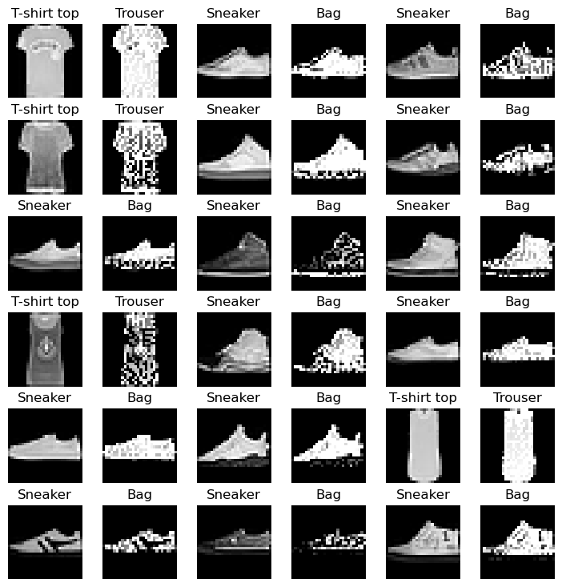

# 第二次作业

- 李锦韬 2201213292
- 作业内容简介：训练 `Fashion-MNIST`数据集上的分类模型；进行定向白盒攻击（FGSM、PGD）；进行定向黑盒攻击（样本迁移、MCMC）；简单对抗训练
- 若样本的真实标签为 `label`，攻击方向目标为使分类器错判为 `(label + 1) % 10`
- 本项目构成情况：
  - ResNet34.ipynb	分类器构建和训练评估
  - white-attack.ipynb	白盒攻击
  - black-attack.ipynb	黑盒攻击
  - adversarial-train.ipynb	对抗训练

## 训练分类器

- 基于ResNet34网络
- 更改输入与输出层，使其能适应 `Fashion-MNIST`数据集
- 训练参数设置：
  - 数据预处理：随机水平翻转、随机裁剪、随机擦除、标准化
  - 优化器：Adam
  - 学习率：0.001，学习率衰减：0.1，每10个epoch衰减一次
  - 损失函数：交叉熵
  - 训练轮数：40
  - 批次大小：128
- 最终在测试集上的精度：$94\%$ 左右
- 作业所有实验采用精度为 $93.71\%$ 的模型进行测试
- 模型文件路径为 `./model/checkpoint-60-93.71.pt`

## 白盒攻击

- 使用迭代的FGSM，逐步修改测试图像，每次给图像变动 $\varepsilon \times \operatorname{Sign}\left( \nabla_{x^{(n)}}\left({x}^{(n)}, \hat{y} | C \right) \right)$ ，其中$\epsilon$为参数

- 经过实验测试，本项目选用$\epsilon=0.05$
- 从分类正确的测试集上随机抽取2000张图像，攻击成功率为 $15.7\%$
- 以下为部分攻击成功的样本图片，图片两两一组，左侧的为原始图像，右侧的为攻击生成图像

## 黑盒攻击

### 使用样本迁移法对课程CNN模型攻击

- 使用迭代的FGSM，梯度在本项目的ResNet34上计算，判断是否攻击成功在封闭的CNN模型上进行

- 本项目同样实验了许多不同的 $\epsilon$ 取值，最终选用 $\epsilon=0.1$，攻击成功率为 $7.9\%$
- 如果取0.5，虽然攻击成功率较高，但是对图像本身的扰动已经较大，不符合黑盒攻击初衷，而取0.1的效果比较理想
- 以下为 $\epsilon=0.5$ 的部分成功攻击样本，图片两两一组，左侧的为原始图像，右侧的为攻击生成图像

- 以下为 $\epsilon=0.1$ 的部分成功攻击样本，图片两两一组，左侧的为原始图像，右侧的为攻击生成图像

### 基于MCMC采样对课程CNN模型攻击

- 每次在图像上增加正态扰动，直到分类器分错成目标攻击类别
- 在1000个课程提供的测试样本上攻击成功率为 $10.4\%$

### 基于MCMC采样对本项目ResNet模型攻击

- 每次在图像上增加正态扰动，直到分类器分错成目标攻击类别

## 对抗训练

